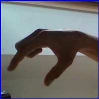
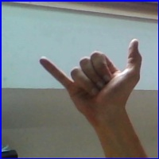

## ASL Alphabet translator

A Python application that is can detect the hand sign for American Sign Language alphabets and can be used to string together sentences.

[ASL Alphabet Dataset](https://www.kaggle.com/grassknoted/asl-alphabet)

 

#### Dataset Details:

- ASL dataset by grassknoted on [kaggle](www.kaggle.com)
- **Size** : 1GB
- Consits of 29 Hand signs for letter A -Z, space, delete and blank
- There are 3000 images for each symbol in different orientations and lighting.
- Total dataset size = 3000 images x 29 catergories x 12kb per image = 1GB

 

#### Self Generated Dataset

- The kaggle Dataset is not generalized and doesn't work well with "real world" images and models tend to Overfit.
- It predicts images from test & train correctly but fails for anything beyond that scope.
- Hence a small dataset can be generated by the user to detect hand signs from others.
- It is better to make a diverse dataset varying in hand position, background and lighting
- Camera application for adding extra images [hand sign camera.py](generate%20self%20dataset)

 

### Required python packages:

- Keras
- Tkinter
- Numpy
- OpenCV
- Pillow

 

It makes use of the Convolutinal Neural Networks to train a model to identify the image/hand signature made in the detection area.

- Model classifies the image into one of 29 classes, alphabets A - Z, space, delete and blank.
- It was constructed and trained utilizing Kaggle's GPU.
- **Model**: kagg_aslmod2_gray.h5
- Model trained on Grayscale images

 

### Main program: proto.py

 

### Hand signs

 

<table style="text-align: center;">
<tr>
<th>Alphabet</th>
<th>Sign</th>
<th>Alphabet</th>
<th>Sign</th>
<th>Alphabet</th>
<th>Sign</th>
</tr>
<tr>
<td>A</td><td></td>
<td>B</td><td></td>
<td>C</td><td></td>
</tr>
<tr>
<td>D</td><td></td>
<td>E</td><td></td>
<td>F</td><td></td>
</tr>
<tr>
<td>G</td><td></td>
<td>H</td><td></td>
<td>I</td><td></td>
</tr>
<tr>
<td>J</td><td></td>
<td>K</td><td></td>
<td>L</td><td></td>
</tr>
<tr>
<td>M</td><td></td>
<td>N</td><td></td>
<td>O</td><td></td>
</tr>
<tr>
<td>P</td><td></td>
<td>Q</td><td></td>
<td>R</td><td></td>
</tr>
<tr>
<td>S</td><td></td>
<td>T</td><td></td>
<td>U</td><td></td>
</tr>
<tr>
<td>V</td><td></td>
<td>W</td><td></td>
<td>X</td><td></td>
</tr>
<tr>
<td>Y</td><td></td>
<td>Z</td><td></td>
<td>space</td><td></td>
</tr>
<tr>
<td>del</td><td></td>
<td>nothing</td><td></td>
</tr>
</table>
